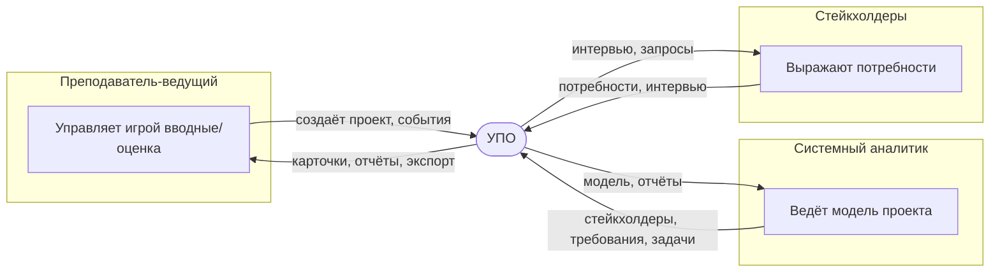

# 1. Видение продукта (Vision)

## 1.1 О продукте
**«Учебный проектный офис (УПО)»** — веб-приложение для проведения ролевых игр на курсах обучения профессии «Системный аналитик». Преподаватель назначает роли заинтересованных лиц, слушатели модерируют полный жизненный цикл проекта.

## 1.2 Проблема
- Курсы проходят в формате вебинаров: нужен быстрый способ смоделировать проект со стейкхолдерами, требованиями, командой, задачами.
- Классические таск-трекеры избыточны и требуют подготовки ролей/доступа.
- Преподавателю нужен инструмент «здесь и сейчас», управляемый одним ведущим (роль АС).

## 1.3 Целевая аудитория
| Роль | Потребность |
|------|-------------|
| Преподаватель (ведущий) | Быстро создавать игровые ситуации, наблюдать, «подбрасывать» вводные |
| Слушатели (стейкхолдеры) | Вводить требования, отвечать на вопросы |
| Системный аналитик (слушатель) | Ведение модели проекта: стейкхолдеры, требования, этапы, задачи, команда, риски, события |

## 1.4 Цели
- Минимизировать время на подготовку и ведение ролевой игры.
- Дать наглядную модель проекта с раскрытием вложенности (этапы → задачи → подзадачи).
- Сохранить артефакты (интервью, отчёты, события) как материал для разбора.

## 1.5 Границы (что входит / что не входит)
**Входит:** ведение справочников; стейкхолдеры и их интервью; проекты с этапами; требования; команда и назначения; задачи/подзадачи с комментариями; события; отчёты; экспорт интервью; управление несколькими базами (несколько игр).

**Не входит (на данный момент):** авторизация и разграничение прав, версионирование задач, интеграция с внешними системами, полноценный импорт/экспорт проектов, многопользовательский онлайн-режим с блокировками.

## 1.6 Ключевая ценность
Единая точка управления учебным проектом, где весь цикл — от стейкхолдера до приёмки задачи — моделируется наглядно и быстро, а результат остаётся в виде артефактов.

## 1.7 Контекстная диаграмма (Mermaid)

