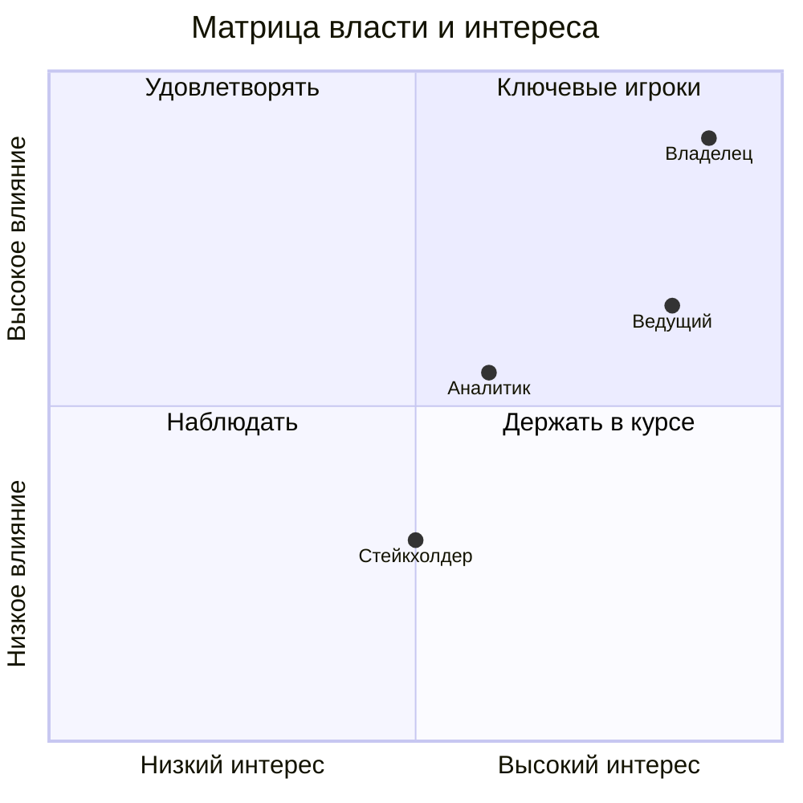

# 3. Заинтересованные лица и карта стейкхолдеров

## 3.1 Роли участников
| Роль | Интерес | Влияние |
|------|---------|---------|
| Преподаватель (ведущий) | Высокий (управление игрой, оценка) | Высокий |
| Системный аналитик (слушатель) | Высокий (ведение модели) | Средний/высокий |
| Стейкхолдер (слушатель) | Средний/высокий | Средний |
| Владелец проекта (условный «заказчик») | Высокий | Высокий |

## 3.2 Модель стейкхолдеров в системе
Справочник **«Типы стейкхолдеров»** задаёт **влияние (1–5)** и **интерес (1–5)**. По ним строится **матрица власти/интереса** (квадранты):
- влияние ≥ 4 и интерес ≥ 4 → **Ключевые игроки** (управлять в первую очередь);
- влияние ≥ 4, интерес < 4 → **Удовлетворять**;
- влияние < 4, интерес ≥ 4 → **Держать в курсе**;
- влияние < 4, интерес < 4 → **Наблюдать**.

## 3.3 Связь стейкхолдера с проектом
Стейкхолдер связывается с проектом:
1. как **главный стейкхолдер** (поле проекта),
2. через **явную связь** «проект ↔ стейкхолдер» (выбор из имеющихся, добавление), 
3. через **требования**, автор которых — стейкхолдер. Присутствует его должность, приоритет, число требований.

## 3.4 Приоритет стейкхолдера
Приоритет (1–5) задаётся в карточке; **по умолчанию подставляется по типу** (влияние типа). Стейкхолдер-«разработчик» может быть создан автоматически из сотрудника с флагом «является стейкхолдером».

## 3.5 Коммуникация
Через **интервью** (дата-время, вопросы-ответы, экспорт в Markdown). Для каждого стейкхолдера доступен список интервью.

## 3.6 Матрица власти/интереса (Mermaid)

