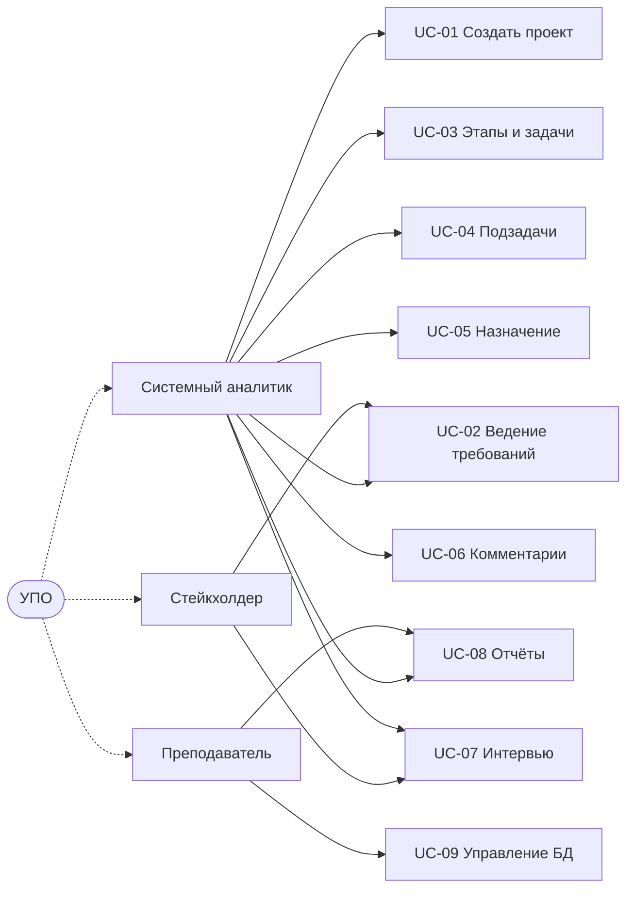

# 6. Варианты использования (прецеденты)

## UC-01 Создание проекта
- **Действующие лица:** Системный аналитик.
- **Предусловия:** есть приоритеты и хотя бы один стейкхолдер (для главного).
- **Основной поток:** выбрать «+ Добавить проект» → указать название, приоритет, главного стейкхолдера, сроки/стоимость → «Создать».
- **Альтернативы:** главный стейкхолдер может быть не выбран; сохранить без него.
- **Постусловие:** проект создан; доступна карточка с вкладками.

## UC-02 Ведение требований
- **Действующие лица:** Аналитик, Стейкхолдер.
- **Основной поток:** в карточке проекта → вкладка «Требования» → «+ Добавить требование» → выбрать тип, приоритет, стейкхолдера, описание, критерий приёмки → «Создать».
- **Постусловие:** требование связано с проектом; учитывается в отчётах.

## UC-03 Управление этапами и задачами
- **Действующие лица:** Аналитик.
- **Основной поток:** вкладка «Этапы» → «+ Добавить этап»; у этапа «+ Задача» (этап подставляется) → указать требование, тип задачи, приоритет, срок, статус.
- **Постусловие:** задача относится к этапу, требованию и имеет тип.

## UC-04 Декомпозиция в подзадачи
- **Основной поток:** у задачи «+ Подзадача» (этап наследуется); у подзадачи «+ Подзадача» (вложенная).
- **Постусловие:** формируется дерево «этап → задача → подзадачи».

## UC-05 Назначение исполнителя
- **Действующие лица:** Аналитик.
- **Основной поток:** «Назначить» у задачи/подзадачи → выбрать исполнителя из проекта (видна должность и загрузка) → доля (по умолчанию делится поровну) → сохранить.
- **Ограничения:** только исполнители проекта; у подзадачи — один; суммарная загрузка сотрудника ≤ 100%; занятость в подзадаче исключает занятость в родителе.

## UC-06 Комментирование
- **Основной поток:** карточка задачи/подзадачи → «+ Комментарий» (выбрать автора-исполнителя проекта) → текст.
- **Постусловие:** последний комментарий отображается сверху.

## UC-07 Интервью и экспорт
- **Основной поток:** карточка стейкхолдера → «Назначить интервью» → дата-время; в интервью «+ Добавить вопрос»; «Экспорт (Markdown)».
- **Постусловие:** файл `interview_N.md` скачивается.

## UC-08 Отчёты и события
- **Основной поток:** меню «Отчёты» → выбрать отчёт; переходы по ссылкам на карточки.
- **Основной поток:** раздел «События» → зафиксировать вводную и решение.

## UC-09 Управление базами данных (игры)
- **Основной поток:** «База данных» → создать новую БД / переключиться / удалить; активная БД отображается в шапке; резервные копии в `data/backups/`.

## UC-10 Обзор вариантов использования (Mermaid)

