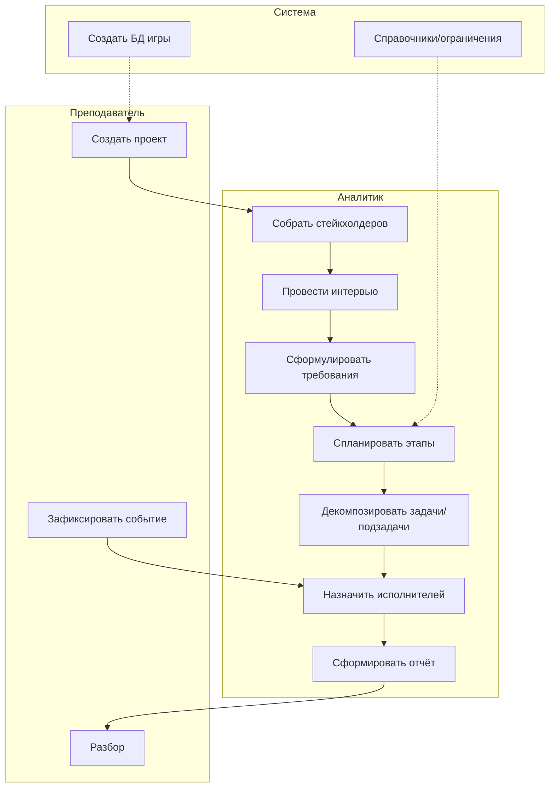
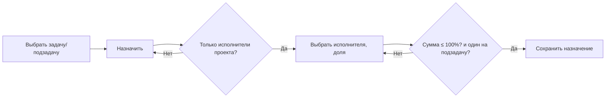
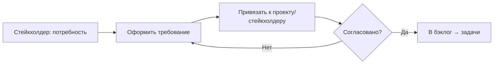

# 9. Модель бизнес-процессов (BPMN)

Текстовое описание ключевых процессов. Диаграммы строятся в нотации BPMN (пул/дорожки, задачи, шлюзы).

## 9.1 Процесс «Ведение учебного проекта» (основной)
Дорожки: **Преподаватель**, **Системный аналитик**, **Стейкхолдер**, **Система (УПО)**.

```
Преподаватель: Создать проект
      ↓
Аналитик: Собрать стейкхолдеров → Провести интервью → Сформулировать требования
      ↓
Аналитик: Спланировать этапы → Декомпозировать задачи/подзадачи
      ↓
Аналитик: Назначить исполнителей (из команды проекта) → Распределить нагрузку
      ↓
[Шлюз: есть вводная преподавателя?] --Да→ Преподаватель: Зафиксировать событие → Аналитик: скорректировать план
      --Нет→
      ↓
Аналитик: Сформировать отчёт → Преподаватель: разбор
```

## 9.2 Процесс «Назначение исполнителя» (детализация)
```
Аналитик: Выбрать задачу/подзадачу → Назначить
  → Система: показать только исполнителей проекта (должность, загрузка)
  → Аналитик: выбрать исполнителя, доля (по умолчанию = 100%/число задач)
  → Система: проверить суммарную загрузку ≤ 100% и «один исполнитель у подзадачи»
      [Да] → Сохранить назначение
      [Нет] → Сообщение об ошибке, изменить
```

## 9.3 Процесс «Приём требования»
```
Стейкхолдер: Сформулировать потребность
  → Аналитик: Оформить требование (тип, приоритет, критерий приёмки)
  → Система: привязать к проекту и стейкхолдеру
  → [Согласовано] → В бэклог → декомпозиция в задачи
```

## 9.4 Управление играми (БД)
```
Преподаватель: Открыть «База данных» → Создать новую БД (имя) / переключиться / удалить
  → Система: инициализировать, бэкап в data/backups/, активная БД в шапке
```

## 9.5 Диаграммы (Mermaid)

### Основной процесс «Ведение учебного проекта» (поток)


### Назначение исполнителя (шлюз с проверками)


### Приём требования

