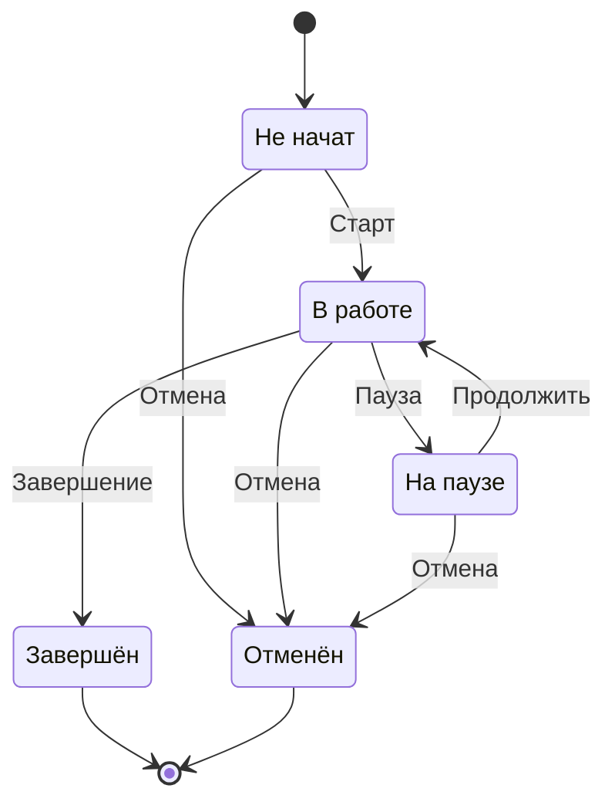
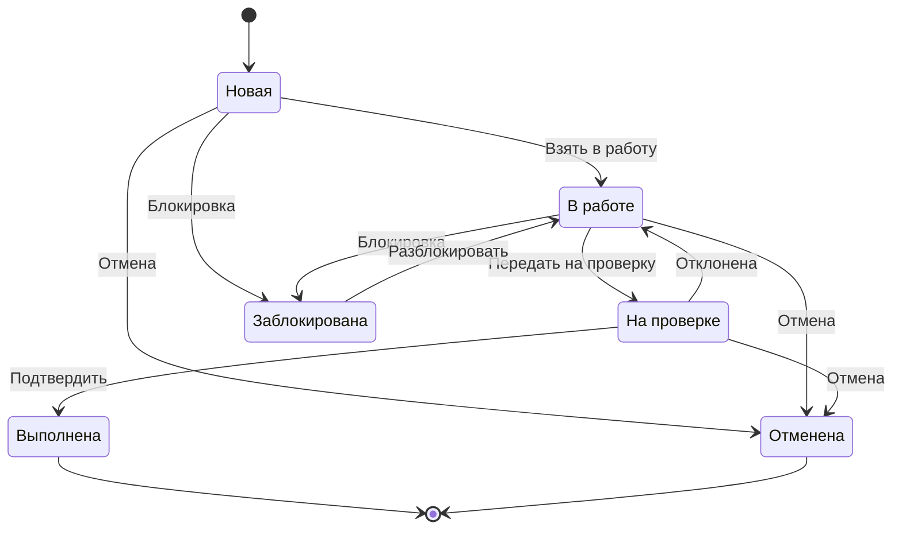

# 10. Диаграммы состояний

## 10.1 Этап проекта
Статусы: **Не начат → В работе → Завершён**, **На паузе**, **Отменён**.
```
(Не начат) --Старт--> (В работе) --Завершение--> (Завершён)
   ↑                        ↑                        ↑
   └--Пауза--(На паузе)--Продолжить--> (В работе)
(Любое активное) --Отмена--> (Отменён)
```

## 10.2 Задача
Статусы: **Новая → В работе → На проверке → Выполнена**; **Заблокирована**, **Отменена**.
```
(Новая) --Взять в работу--> (В работе) --Передать на проверку--> (На проверке)
   |                              |                                    |
   |(Блокировка)                  |(Блокировка)                        |(Отклонена→В работе)
   ↓                              ↓                                    ↓
(Заблокирована) --Разблокировать--> (В работе) ; (На проверке) --Подтвердить--> (Выполнена)
(Новая/В работе/На проверке) --Отмена--> (Отменена)
```
Просрочка: если `срок < сегодня` и статус не «Выполнена/Отменена» → индикатор/красный цвет (не отдельное состояние).

## 10.3 Подзадача
Подзадача использует аналогичные статусы задачи; имеет **одного исполнителя** и может вкладываться в другую подзадачу (иерархия, а не отдельное состояние).

## 10.4 Проект (жизненный цикл)
Определяется **этапами**: инициация → анализ → проектирование → разработка → тестирование → внедрение → закрытие. Состояние проекта — агрегат состояний этапов (в отчёте «Прогресс проекта»).

## 10.5 Диаграммы (Mermaid)

### Этап


### Задача


### Подзадача
Подзадача использует те же статусы, что и задача, но имеет **одного исполнителя** и произвольную вложенность. Просрочка (`срок < сегодня`, статус не «Выполнена/Отменена») отображается красным — это атрибут, а не состояние.
