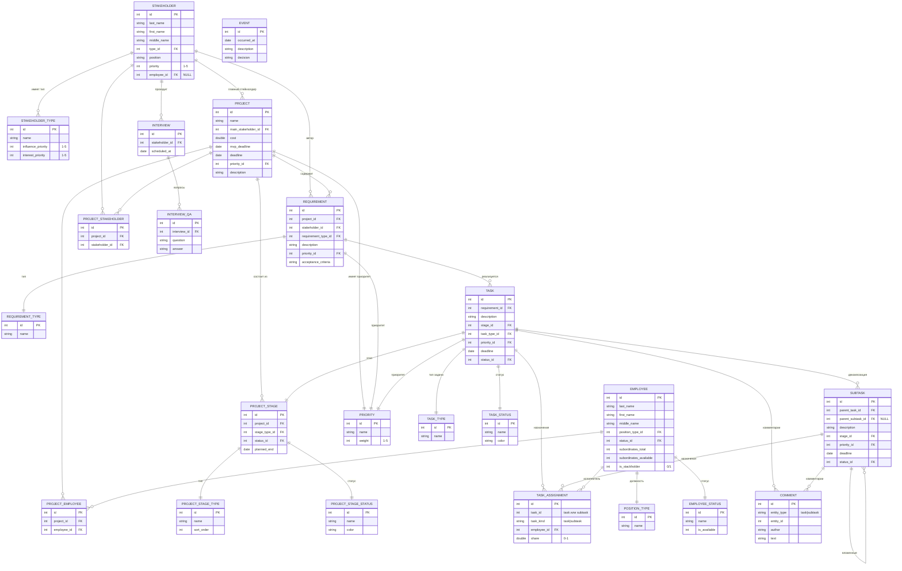
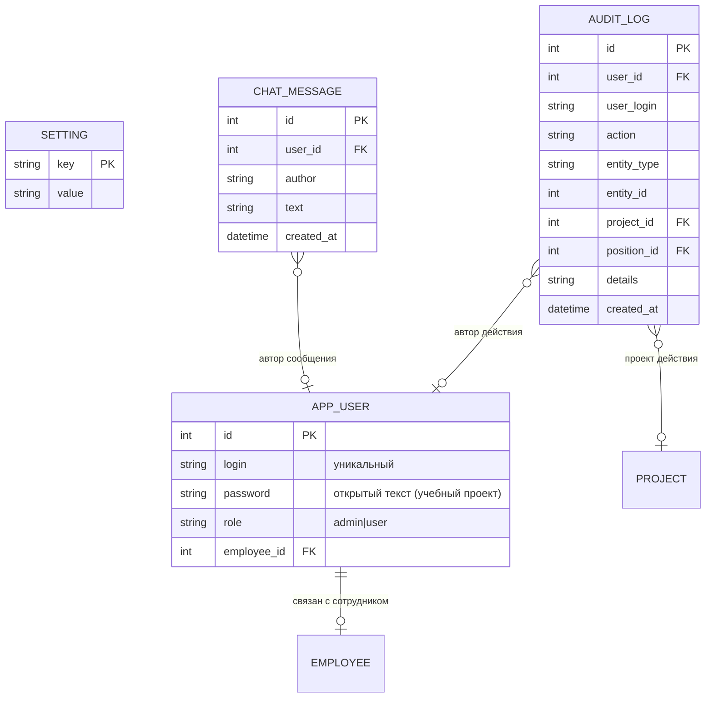

# 11. Модель данных (ER)

Текстовое описание. Реализация в DDL — `init_db()` в `main.py`.

## 11.1 Справочники (словари)
`priority`(id, name, weight 1–5)
`stakeholder_type`(id, name, influence_priority 1–5, interest_priority 1–5)
`requirement_type`(id, name)
`position_type`(id, name)
`employee_status`(id, name, is_available)
`project_stage_type`(id, name, sort_order)
`project_stage_status`(id, name, color)
`task_status`(id, name, color)
`task_type`(id, name)

## 11.2 Основные сущности
- **stakeholder**(id, last_name, first_name, middle_name, type_id→stakeholder_type, position, priority 1–5, employee_id→employee NULL)
- **project**(id, name, main_stakeholder_id→stakeholder, cost, mvp_deadline, deadline, priority_id→priority, description)
- **requirement**(id, project_id→project, stakeholder_id→stakeholder, requirement_type_id→requirement_type, description, priority_id→priority, acceptance_criteria)
- **project_stage**(id, project_id→project, stage_type_id→project_stage_type, status_id→project_stage_status, planned_end)
- **employee**(id, last_name, first_name, middle_name, position_type_id→position_type, status_id→employee_status, subordinates_total, subordinates_available, is_stackholder)
- **task**(id, requirement_id→requirement, description, stage_id→project_stage, task_type_id→task_type, priority_id→priority, deadline, status_id→task_status)
- **subtask**(id, parent_task_id→task, parent_subtask_id→subtask, description, stage_id→project_stage, priority_id→priority, deadline, status_id→task_status)
- **task_assignment**(id, task_id, task_kind IN('task','subtask'), employee_id→employee, share 0–1)
- **interview**(id, stakeholder_id→stakeholder, scheduled_at)
- **interview_qa**(id, interview_id→interview, question, answer)
- **interview_audio**(id, interview_id→interview, filename, original_name, mime, duration_ms) — записи интервью (диктофон/загрузка)
- **transcript_segment**(id, interview_id→interview, audio_id→interview_audio, start_ms, end_ms, speaker, text) — посегментные таймкоды + метка спикера
- **comment**(id, entity_type IN('task','subtask'), entity_id, author, text, created_at)
- **event**(id, occurred_at, description, decision)

## 11.3 Связи «многие-к-одному»
- project_stakeholder(project_id, stakeholder_id) — между проектом и стейкхолдером
- project_employee(project_id, employee_id) — между проектом и исполнителями

## 11.4 Ключевые ограничения
- `task_type.name` — UNIQUE.
- `project_stakeholder` / `project_employee` — UNIQUE(project_id, related_id).
- `task_assignment` — частичный уникальный индекс: не более одного активного назначения подзадачи (`WHERE task_kind='subtask' AND is_deleted=0`).
- Задача: обязательны `requirement_id`, `task_type_id`, `stage_id` (проверяется в коде).
- Суммарная загрузка сотрудника ≤ 100% (проверяется в коде).
- Каскадное удаление: этап → задачи → подзадачи; задача → подзадачи; подзадача → вложенные подзадачи (мягкое удаление `is_deleted`).
- `subtask.parent_task_id` — корневая задача; `parent_subtask_id` — непосредственный родитель (вложенность).

## 11.5 Схема взаимосвязей (упрощённо)
```
priority ◄── project
stakeholder_type ◄── stakeholder ◄── project (main)
requirement ◄── project, stakeholder, requirement_type, priority
project_stage ◄── project, stage_type, stage_status
employee ◄── position_type, employee_status
project_stakeholder (project ↔ stakeholder)
project_employee (project ↔ employee)
task ◄── requirement, stage, task_type, priority, task_status
subtask ◄── task, subtask(parent), stage, priority, task_status
task_assignment (task/subtask ↔ employee)
interview ◄── stakeholder ; interview_qa ◄── interview
comment (→ task/subtask)
event
```

## 11.6 ER-диаграмма (Mermaid)



## 11.x Аутентификация, аудит и чат (дополнение)



- `task_assignment` дополнена полями `assigned_by_user_id` (FK → `app_user`) и `assigned_at` — кто и когда назначил исполнителя.
- `comment` дополнена `user_id` (FK → `app_user`); `author` заполняется ФИО текущего пользователя.
- `task_status` содержит статус «Принята к исполнению».
- `AUDIT_LOG` неизменяем: маршрутов редактирования/удаления нет.
