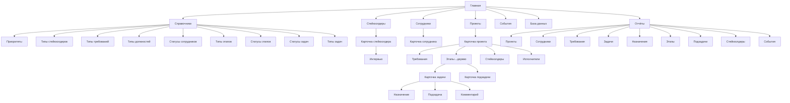
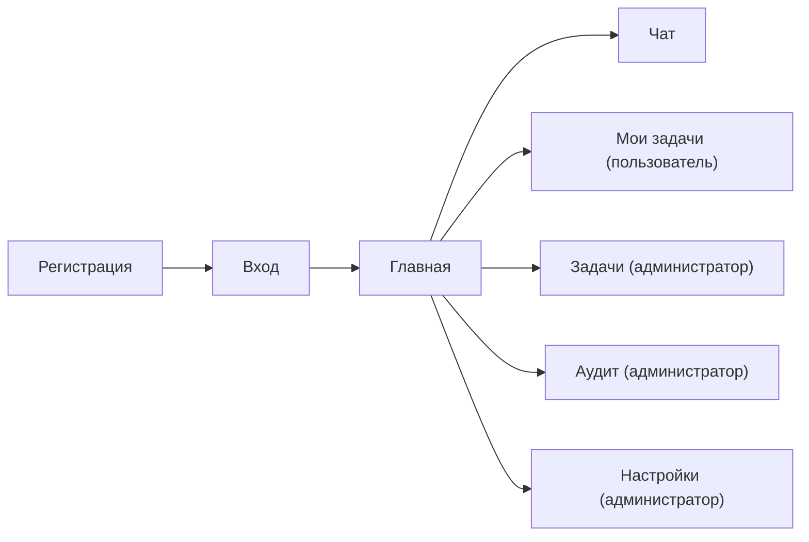

# 12. Прототип и навигация

## 12.1 Общая структура
- **Шапка:** заголовок + «Активная БД: <имя> | управление БД».
- **Меню:** Главная | Справочники ▾ | Стейкхолдеры | Сотрудники | Проекты | События | База данных | Отчёты ▾.

## 12.2 Справочники (подменю)
Приоритеты, Типы стейкхолдеров, Типы требований, Типы должностей, Статусы сотрудников, Типы этапов, Статусы этапов, Статусы задач, Типы задач.

## 12.3 Основные экраны
| Экран | Маршрут | Содержимое |
|-------|---------|------------|
| Главная | `/` | Сводка · статистика |
| Проекты | `/projects` | Список, «Открыть» |
| Карточка проекта | `/projects/<id>` | Вкладки: Требования, Этапы, Стейкхолдеры, Исполнители |
| Стейкхолдеры | `/stakeholders` | Список, «Открыть» |
| Карточка стейкхолдера | `/stakeholders/<id>` | Профиль, проекты, требования, интервью |
| Сотрудники | `/employees` | Список, «Открыть» |
| Карточка сотрудника | `/employees/<id>` | Профиль, загрузка, задачи/подзадачи |
| Задачи | `/tasks` | Список, «Открыть» |
| Карточка задачи | `/tasks/<id>` | Проект/этап/тип/срок, исполнители, подзадачи, комментарии |
| Карточка подзадачи | `/subtasks/<id>` | Исполнители, вложенные подзадачи, комментарии |
| Назначения | `/task_assignments` | Список |
| События | `/events` | Список |
| Интервью | `/interviews` | Список |
| Карточка интервью | `/interviews/<id>` | Вопросы-ответы, диктофон (запись с микрофона), транскрипт с таймкодами, экспорт |
| Отчёты | `/reports/...` | 9 отчётов |
| База данных | `/database` | Создать/переключить/удалить БД |

## 12.4 Дерево этапов (вкладка «Этапы»)
```
Инициация [Не начат] План.окончание…        [+ Задача] [Удалить]
 └─ Задача #1 [Новая] Тип:… Приоритет:… Срок:…   [Назначить][Изменить][+ Подзадача][Удалить]
     └─ Подзадача #1 [Новая] …                   [Назначить][Изменить][+ Подзадача][Удалить]
```
- заголовки «Задача #N» / «Подзадача #N» — ссылки в карточки;
- у задачи виден срок (просроченный — красным);
- описания в дереве не показываются (только в карточках).

## 12.5 Форма назначения исполнителя
Тип задачи → задача/подзадача → **Сотрудник (должность, загрузка %)** → доля (по умолчанию делится поровну). Доступны только исполнители проекта; у подзадачи — один; сумма ≤ 100%.

## 12.6 Карточка задачи/подзадачи
Сверху действия: **Назначить**, **+ Требование** (для задачи), **+ Подзадача**, **+ Комментарий**. Внизу — списки исполнителей, подзадач, комментариев.

## 12.7 Схема навигации (Mermaid)



## 12.8 Аутентификация, роли и новые разделы

- **Вход/Выход** — кнопка в правом краю главного меню. Анонимный пользователь видит кнопку «Вход»; вошедший — ФИО, роль и «Выход».
- **Форма входа**: логин, пароль, кнопка «Регистрация».
- **Форма регистрации**: логин, пароль, фамилия, имя, отчество (все обязательны); после успеха — возврат на форму входа.
- Ролевые пункты меню:
  - **Администратор**: «Задачи» (вкладки «Не назначенные», «Не принятые к исполнению», «Просроченные»), «Аудит», «Настройки»;
  - **Пользователь**: «Мои задачи»;
  - всем: «Чат».
- **Карточка задачи/подзадачи**: показывается, кто назначил исполнителя; исполнителю и администратору доступна мини-форма смены статуса.


